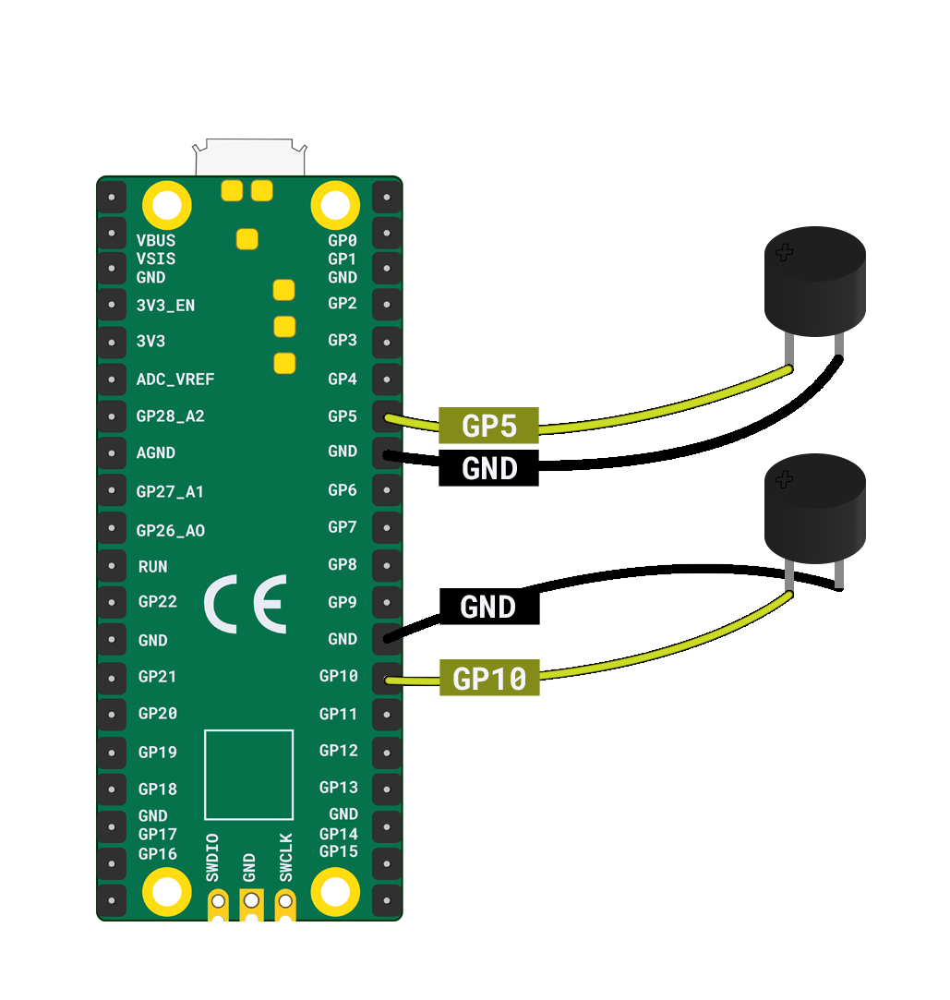

Pour câbler deux buzzers à un Raspberry Pi Pico, tu auras besoin :

+ Un Raspberry Pi Pico
+ 2 x Buzzers passifs
+ 4 x fils de liaison prise-prise

Prends le **premier buzzer** et connecte la patte **positive** à **GP5** et la patte **négative** à la broche **GND** la plus proche.

Ensuite, prends le **second buzzer** et connecte la patte **positive** à **GP10** et la patte **négative** à la broche **GND** la plus proche.

**Astuce**: Pour identifier la branche positive sur un buzzer, recherche la patte la plus longue. Tu peux également voir un symbole **+** en haut du buzzer.

