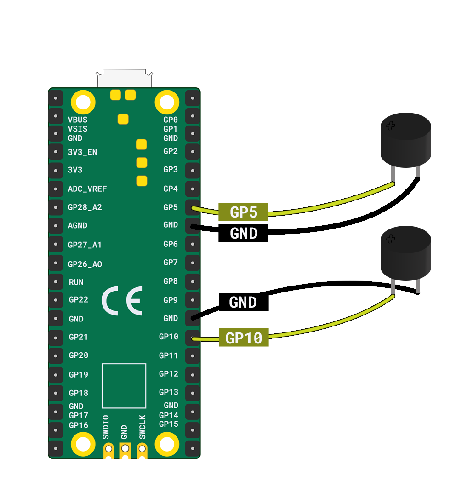

Om twee zoemers op een Raspberry Pi Pico aan te sluiten, heb je het volgende nodig:

+ Een Raspberry Pi Pico
+ 2 x passieve zoemers
+ 4 x socket-socket jumper wires

Take the **first buzzer** and connect the **positive** leg to **GP5** and the **negative** leg to the nearest **GND** pin.

Neem vervolgens de **tweede buzzer** en verbind het **positieve** been aan **GP10** pin en het **negatieve** been aan de dichtstbijzijnde **GND** pin.

**Tip**: Om het positieve been op een zoemer te vinden, zoek je het langste been. Je kunt het ook zien door het **+** symbool aan de bovenkant van de zoemer.

